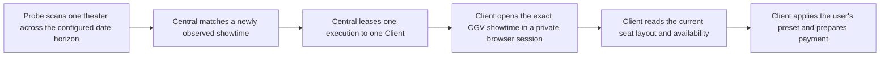

# Booking execution

Booking discovery and booking execution are separate paths. Product behaviour,
state ownership, and unresolved-capability boundaries are fixed in
`docs/product-specification.md`; this document narrows that contract to the
booking critical path.

## Discovery

- A scan covers one theater and every date from today through the policy horizon.
- Results are shared across auditoriums, movies, and users. Matching monitors never create duplicate theater fetches.
- One booking monitor covers both stages: it raises discovery cadence before a showtime is found, then keeps watching
  the same target for newly available preferred seats until booking succeeds or the monitor expires.
- The first observation of a showtime is a detection event, not proof of the exact CGV opening time.

Discovery work is ordered by lane before its due time:

1. `P0` — an active booking target whose matching showtime has not been found;
2. `P1` — a theater/date range with a recently changed schedule;
3. `P2` — a cancellation-seat target after its showtime is already known;
4. `P3` — ordinary catalog and schedule observation.

A lower lane can never outrank a due higher lane by accumulating a numeric score. Within a lane, the oldest due work
runs first. Recent-change priority expires after the configured observation window, returning the work to its normal
lane. The scheduler must reserve capacity for ordinary observation so sustained demand cannot stop catalog coverage.

## Execution

- Central sends the exact observed showtime and grants one short, renewable execution lease.
- CGV account login is optional for entering seat selection. The Client uses a private local browser session and may
  continue through CGV's non-member flow. Account cookies, non-member details, and payment authentication never leave
  the device.
- The Client opens the live seat-selection flow immediately, reads the current layout and availability, applies the
  preset, selects seats, and stops at payment.
- Losing the execution lease cancels browser work. Another Client may claim a later retry.
- A missing preferred seat or a showtime that is not yet selectable does not trigger immediate browser retries.
  Central waits for a distinct later live-seat snapshot that changes the matching result from false to true, then
  rearms that exact command once. A positive aggregate seat count or elapsed cooldown alone is not a signal.
  Other transient preparation failures retain the bounded execution retry budget.

## Session readiness

- Remembering a CGV account is opt-in. The account ID and password are stored only in the operating system's local
  credential vault; they are never sent to Central, exported in a `.cnk` file, logged, or placed in ordinary settings.
- While the user has an active booking target, the Client prepares isolated browser capacity. It restores and checks
  a member-session snapshot when one exists and otherwise prepares the supported non-member path.
- Saved credentials may prefill an explicit visible login flow. A CAPTCHA, additional verification, repeated
  authentication failure, or changed login contract always asks the user to continue locally; Cineko never submits
  credentials in a hidden browser or bypasses a challenge.
- The browser identity and proxy identity bound to the account session remain stable across health checks and
  reauthentication. Discovery Probes continue to use disposable randomized identities.

## Seat presets

A stored seat layout is never required to create a preset or start an execution. Presets are rules applied to the
live seat response: party size, adjacent-seat requirement, preferred rows and types, edge avoidance, and optional
explicit candidate labels. When explicit labels are absent, every currently available seat is a candidate.

Static seat layouts may be retained for analysis or preview, but they are disposable hints. They cannot gate a
monitor, an execution command, or seat selection, and they are never authoritative over the live CGV response.
