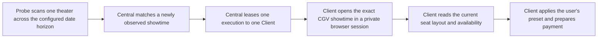

# Booking execution

Booking discovery and booking execution are separate paths. Product behaviour,
state ownership, and unresolved-capability boundaries are fixed in
`docs/product-specification.md`; this document narrows that contract to the
booking critical path.

```mermaid
flowchart LR
    A["Probe scans one theater across the configured date horizon"] --> B["Central matches a newly observed showtime"]
    B --> C["Central leases one execution to one Client"]
    C --> D["Client opens the exact CGV showtime in a private browser session"]
    D --> E["Client reads the current seat layout and availability"]
    E --> F["Client applies the user's preset and prepares payment"]
```

## Discovery

- A policy covers one theater and a rolling horizon. Each assignment scans only
  the bounded provider-date subset selected by Central for that cycle; ordinary
  baseline work eventually covers the complete horizon.
- Results are shared across auditoriums, movies, and users. Matching monitors never create duplicate theater fetches.
- One booking monitor covers both stages: it raises shared discovery cadence before a showtime is found, then the
  authenticated Client retains one exact seat page for newly available preferred seats until booking succeeds,
  execution is cancelled, protection stops the session, or showtime starts.
- The first observation of a showtime is a detection event, not proof of the exact CGV opening time.

Discovery work is ordered by lane before its due time:

1. `P0` — an active booking target whose matching showtime has not been found;
2. `P2` — a theater/date range with a recently changed schedule;
3. `P3` — ordinary catalog and schedule observation.

A lower lane can never outrank a due higher lane by accumulating a numeric score. Within a lane, the oldest due work
runs first. Recent-change priority expires after the configured observation window, returning the work to its normal
lane. The scheduler must reserve capacity for ordinary observation so sustained demand cannot stop catalog coverage.

## Execution

- Central sends the exact observed showtime and grants one short, renewable execution lease.
- Every live-seat submission is fenced by its source: layout collection echoes
  the Central `claimId/claimToken`, while booking and cancellation work echoes
  the execution `commandId/leaseToken`. The two authorities are not interchangeable.
- CGV member login or non-member phone verification is required before seat selection. Cineko's automated path uses
  the authenticated member session completed by the user in a visible CAPTCHA browser. Account cookies, credentials,
  and payment authentication never leave the device.
- The Client opens the live seat-selection flow immediately, reads the current layout and availability, applies the
  preset, selects seats, and stops at payment.
- Losing the execution lease cancels browser work and leaves the outcome ambiguous.
  Central marks the same monitor `payment_unknown`; no Client may claim another
  execution until the user verifies CGV history and explicitly rearms it.
- A missing preferred seat keeps the same authenticated page open and refreshes it at a randomized 1.5-2.5 second
  interval until a seat is held or showtime starts. Central does not run an anonymous availability assignment or
  rearm from a positive aggregate count. Other transient preparation failures use the explicit `retry_requested`
  result and retain the bounded execution retry budget. A `failed` result is terminal and is never inferred to be
  retryable from an arbitrary reason string.
- Authentication, CAPTCHA, provider protection, and provider-contract failures stop automatically and require
  visible user action. Lease loss or Client interruption is ambiguous and moves the monitor to `payment_unknown`
  rather than risking a duplicate attempt.

## Session readiness

- Remembering a CGV account is opt-in. The account ID and password are stored only in the operating system's local
  credential vault; they are never sent to Central, exported in a `.cnk` file, logged, or placed in ordinary settings.
- While the authenticated user has an active booking target, the Client prepares isolated browser capacity. It
  restores and checks the member-session snapshot; missing or expired authentication requests no warm capacity and
  asks the user to complete the visible login flow.
- Saved credentials may prefill an explicit visible login flow. A CAPTCHA, additional verification, repeated
  authentication failure, or changed login contract always asks the user to continue locally; Cineko never submits
  credentials in a hidden browser or bypasses a challenge.
- The browser identity and proxy identity bound to the account session remain stable across health checks and
  reauthentication. Discovery Probes continue to use disposable randomized identities.

## Seat presets

Central's cached seat layout is required to render and save an auditorium seat
preset. Presets are rules applied to the live seat response: party size,
adjacent-seat requirement, preferred rows and types, edge avoidance, and
optional explicit candidate labels. When explicit labels are absent, every
currently available seat is a candidate.

The cached layout is not the live availability authority. Central emits an
execution when a matching future showtime is discovered even if aggregate
availability is zero or sold out. Client reads the provider's live seats on the
exact page, applies the preset there, and keeps that same page for cancellation
seats; only the current authenticated response can authorize a seat hold.
