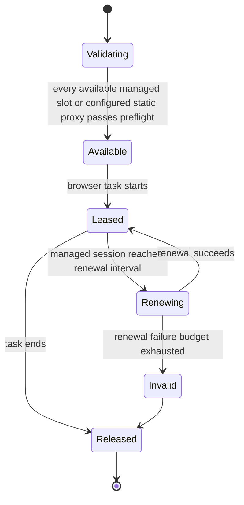

# Probe egress

Central selects a semantic egress policy. Proxy addresses, credentials, session IDs, and provider topology remain local
to the Probe and never cross the wire.

## Policy

- Discovery assignments use `scan_default`.
- A managed deployment may require a proxy. An unmanaged or Client-owned Probe may use direct egress when local policy
  allows it.
- Standard HTTP, HTTPS, and SOCKS5 proxies are local inventory. A managed proxy service is an alternative inventory,
  not an additional hop.
- Discovery chooses a valid proxy independently for each browser process. An authenticated browser session keeps one
  stable proxy identity for its full session lifetime.

## Lease lifecycle

Proxy configuration is accepted only after control-plane and data-plane validation. A scan fails closed when its lease
is lost; it does not silently switch to direct egress. Secrets are file-backed runtime inputs and must never appear in
catalog data, logs, deployment inventory, or repository documentation.
