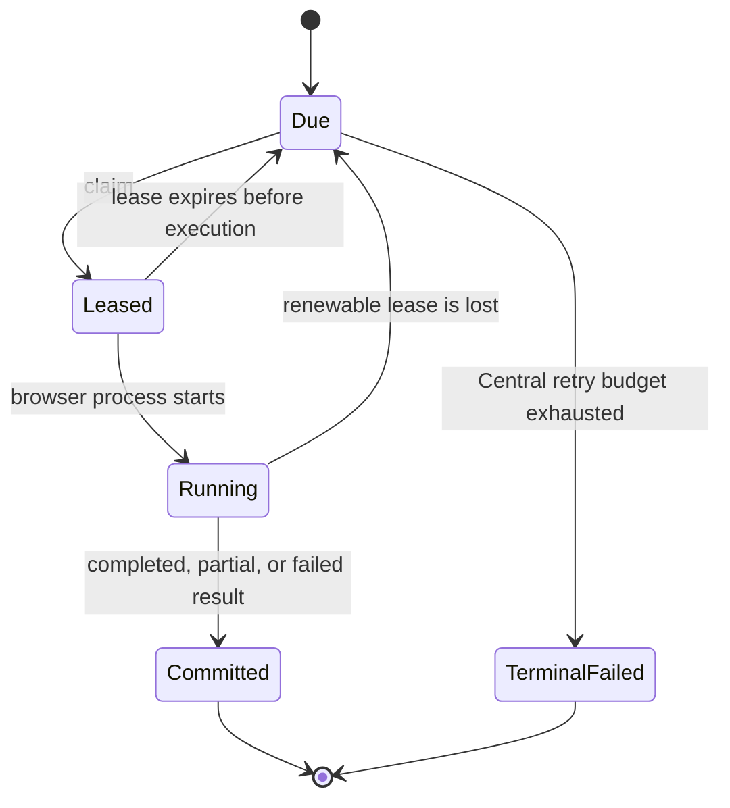

# Probe runtime

This document fixes the lifecycle shared by Central and every standalone or embedded Probe. Endpoint payloads are the
types in `types.go`; capability and protocol values are the constants in `protocol.go`.

## Service points and mutations

| Operation | Durable mutation | Idempotency and terminal boundary |
| --- | --- | --- |
| Register Probe | Upsert one installation and issue a short-lived Probe session | Same installation replaces its session; invalid credential or protocol is terminal |
| Probe heartbeat | Replace current health, drain, capability, slot, and active-assignment state | Safe to repeat; unauthorized or incompatible minimum policy is terminal for the session |
| Disconnect Probe | Mark capacity unavailable and release unclaimed work | Safe to repeat; active leases expire or are reconciled by Central |
| Claim assignment | Lease one due assignment to one eligible Probe | No work returns an empty success; one assignment has at most one live lease |
| Assignment heartbeat | Extend the current lease | Stale or wrong lease is terminal for that run |
| Commit result | Atomically store result, catalog changes, and observations | Idempotent by assignment, run, lease, and content hash |

## Probe states

```mermaid
stateDiagram-v2
    [*] --> Registering
    Registering --> Ready: registration and initial heartbeat succeed
    Ready --> Busy: assignment claimed
    Busy --> Ready: result committed
    Ready --> Draining: local shutdown or Central drain
    Busy --> Draining: drain requested; current lease may finish
    Draining --> Disconnected: no active assignment
    Ready --> Registering: session unauthorized
    Busy --> Registering: session unauthorized
    Ready --> Failed: three consecutive heartbeat failures
    Busy --> Failed: lease lost or deadline reached
    Registering --> Failed: terminal registration failure
```

- Readiness begins only after the initial heartbeat and ends when the runtime exits or loses Central connectivity three
  consecutive times.
- A Probe below `minimumRuntimeVersion` or `minimumBrowserRevision` drains and exits. It cannot claim new work.
- Central owns retry scheduling. A Probe retries only transport/5xx operations with bounded exponential backoff; it
  never retries unauthorized, invalid protocol, invalid payload, expired lease, or incompatible runtime policy.
- Graceful shutdown first reports zero available slots and draining state, then disconnects. Central remains the
  authority when that final request cannot be delivered.

## Assignment states

One assignment owns one browser process and one page. A Probe must cancel browser work immediately after lease loss.
Central decides whether a failed or expired assignment returns to `Due`; Probe never creates replacement work.
